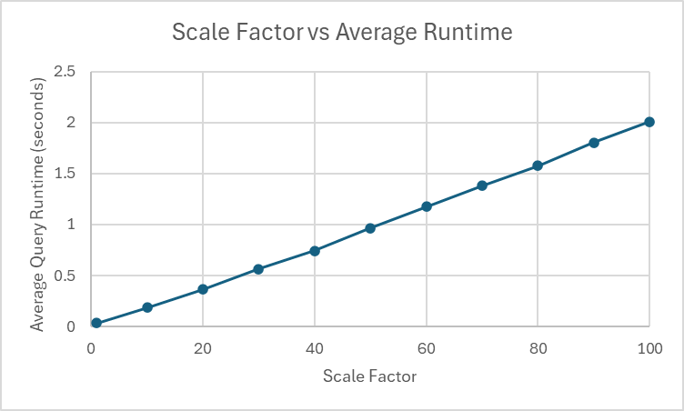
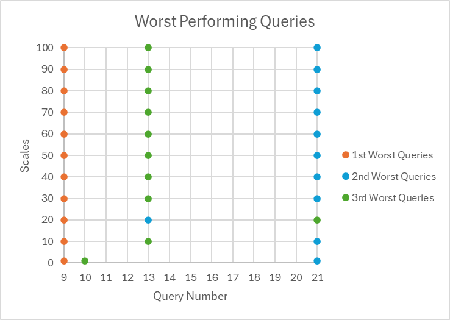

# TPC-H Experiments
We conducted experiments to analyze the performance of TPC-H queries in general and across different database scales.

## Brief Background
The **TPC-H benchmark** includes 22 complex decision support queries designed to simulate real-world business questions. They operate over a schema of 8 tables representing a fictional parts supplier and customer ordering system. Each query is written in SQL and covers things like profit analysis, pricing trends, shipping delays, and customer behavior.

The **scale factor** (SF) in TPC-H determines the size of the database — how much data is generated for benchmarking.

Examples:
SF1 means database size is 1GB which is small.
SF10 means database size is 10GB which is medium.
SF100 means database size is 100GB which is large.

## Experiment Explanation
Ran experiments on [WPI Turing Server](https://arc.wpi.edu/computing/hpc-clusters/). 
- Code for the experiments can be found in experiments.py
- Using [DuckDB package](https://duckdb.org/), we are able to analyze the performance of the 22 TPC-H queries across different scales [1, 10, 20, 30, 40, 50, 60, 70, 80, 90, 100].

## Experiment Results
Here are some preliminary results.

We can see that as the scale of the database increases, as does the average query runtime.

Looking at the worst performing queries based on runtime, we some consistency between the worst performing queries. This is typically 9, 21, 13 respectively. 

